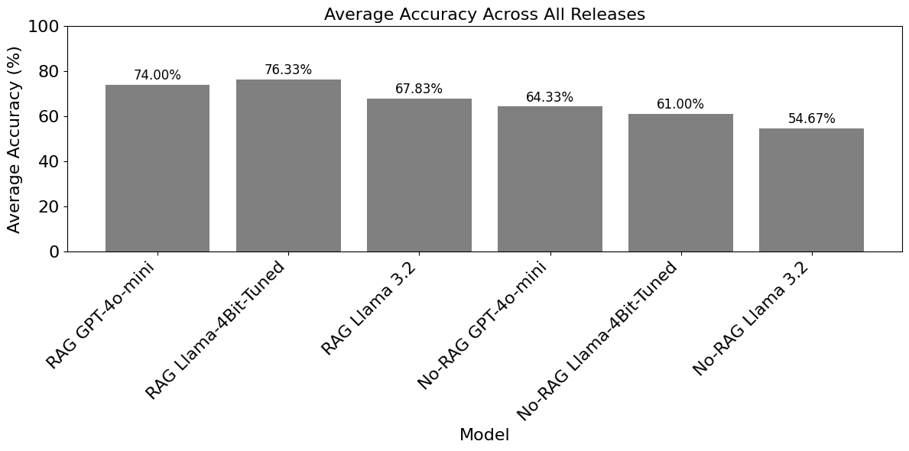
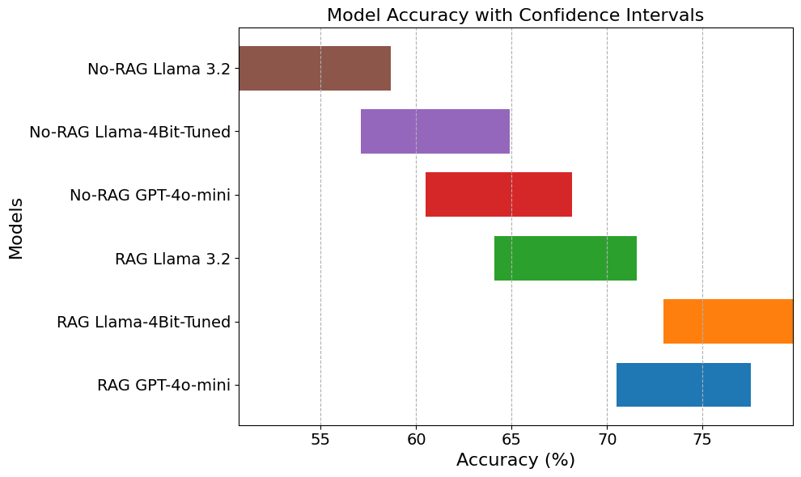
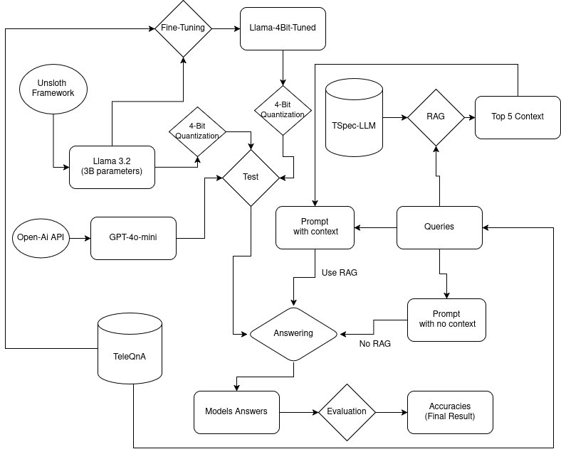
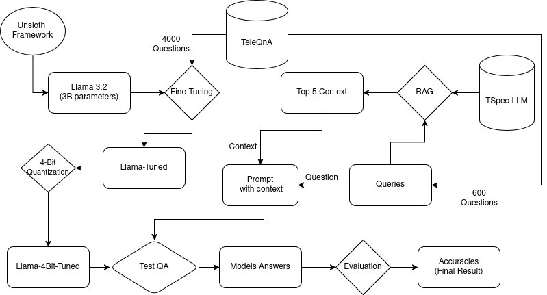

# 3GPP LLM Evaluation - Project Overview

This project demonstrates that lightweight **Large Language Models (LLMs)** can achieve strong performance on tasks requiring technical and specialized knowledge, such as interpreting **3GPP telecommunications standards**, while being efficient enough for deployment on resource-constrained hardware like edge devices or consumer-grade GPUs (e.g., *NVIDIA RTX 3050 Ti*). By leveraging a [Llama 3.2 model](https://github.com/unslothai/unsloth) with only **3 billion parameters**, enhanced with **Fine-Tuning** and **Retrieval-Augmented Generation (RAG)**, and quantized to **4 bits**, we achieved results comparable to or better than the proprietary **GPT-4o-mini model**, using significantly less memory (2.768 GB vs. resource-heavy alternatives). This approach, detailed in our paper *[Lightweight LLMs for 3GPP Specifications: Fine-Tuning, Retrieval-Augmented Generation and Quantization](Papers/Lightweight%20LLMs%20for%203GPP%20Specifications:%20Fine-Tuning,%20Retrieval-Augmented%20Generation%20and%20Quantization.pdf)*, utilizes the [TeleQnA dataset](https://github.com/netop-team/TeleQnA) for training and evaluation and the [TSpec-LLM dataset](https://huggingface.co/datasets/rasoul-nikbakht/TSpec-LLM) for RAG-based context retrieval.

For a streamlined guide to reproduce the core experiments, see the lightweight repository:  
[https://github.com/josearimatea/3gpp_llm_eval_light](https://github.com/josearimatea/3gpp_llm_eval_light)

# Key Results

The experiments evaluated three models—**GPT-4o-mini**, **Llama 3.2 3B**, and a fine-tuned **Llama-4bit-Tuned**—on **600 multiple-choice questions** from TeleQnA, evenly split across **3GPP Releases 17, 18, and others** (200 questions each). The focus was on achieving high accuracy with minimal computational overhead, enabling practical deployment on modest hardware. Key findings include:

- **Llama-4bit-Tuned with RAG**: Achieved the highest average accuracy of **76.3%**, surpassing **GPT-4o-mini** (74.0%) despite being quantized to **4 bits**, reducing memory usage to **2.768 GB** (peak 3.5 GB during RAG inference) compared to larger models requiring over 6 GB unquantized.
- **Efficiency through Quantization**: The 4-bit quantization of Llama 3.2 3B, fine-tuned on **4,000 TeleQnA questions**, enabled local execution on an *NVIDIA RTX 3050 Ti* (3.712 GB max memory), making it viable for resource-constrained environments like edge devices or softwarized networks.
- **RAG Impact**: Boosted accuracy significantly across all models, with **Llama 3.2 3B** improving from **54.7%** (no RAG) to **67.8%** (with RAG), a **13.1% gain**, showing RAG’s effectiveness in compensating for limited internal knowledge in smaller, quantized models.
- **Fine-Tuning Benefit**: Fine-tuning Llama-4bit-Tuned on telecom-specific data increased its accuracy by up to **14.5%** over the untuned Llama 3.2 3B (e.g., **76.3%** vs. **67.8%** with RAG), particularly excelling on Release 18 (81.5%).

These results, detailed in *[Lightweight LLMs for 3GPP Specifications: Fine-Tuning, Retrieval-Augmented Generation and Quantization](Papers/Lightweight%20LLMs%20for%203GPP%20Specifications:%20Fine-Tuning,%20Retrieval-Augmented%20Generation%20and%20Quantization.pdf)*, highlight the feasibility of deploying efficient, open-source LLMs for telecom question-answering without sacrificing performance, even on hardware with limited resources.

## Figure of Results

The figure below, located in the repository at `Figures/Large_all_releases_600.png`, illustrates the average accuracy across all releases for the three models:



## Confidence Interval Analysis

To provide a statistical perspective, the figure below shows the accuracy of each model with **95% confidence intervals** across the **600 test questions**:



This image shows **Llama-4bit-Tuned with RAG** achieving **76.3%** accuracy with a tight confidence interval, indicating reliable performance compared to **GPT-4o-mini** (74.0%) and **Llama 3.2 3B** (67.8% with RAG), despite its reduced memory footprint.

## Complete Flowchart

The following flowchart outlines the entire workflow, from data preprocessing to evaluation:



This diagram illustrates the process from dataset acquisition (TeleQnA and TSpec-LLM), through fine-tuning and RAG integration, to evaluation on modest hardware.

## Flowchart of Tuned Model

Below is a focused flowchart for the fine-tuned **Llama-4bit-Tuned** model with RAG:



This highlights the fine-tuning of **Llama 3.2 3B** on **4,000 TeleQnA questions**, quantization to **4 bits**, RAG integration, and evaluation on **600 test questions**.

# Cloning and Setup

To explore the project:

## Step 1: Clone the Repository

```bash
git clone https://github.com/josearimatea/3gpp_llm_evaluation.git
cd 3gpp_llm_evaluation
```

### Step 2: Install Dependencies

```bash
pip install torch transformers sentence-transformers faiss-gpu unsloth langchain pandas numpy jupyter
```

**Note**: Ensure **CUDA compatibility** for local GPU use, or use **Google Colab**.

---

## Reproduction Guide

For a complete step-by-step reproduction guide, refer to the lightweight repository:  
[https://github.com/josearimatea/3gpp_llm_eval_light](https://github.com/josearimatea/3gpp_llm_eval_light)

---

## Agents Exploration

This project also investigated **AI agents** combined with **RAG** for enhanced query handling. While promising, agent-based results (e.g., **56% accuracy** with **Llama 3.2 3B** and **Llama 3.1 70B**) did not surpass **RAG-only performance**, highlighting challenges in **prompt tuning** and **step sequencing**. See the report for more details.

---

## Folder Structure

### Dataset Folder

This folder is intended to store the processed datasets used in the project. It does not come pre-populated, so you’ll need to download and process the data manually:

#### Contents
- Processed versions of TSpec-LLM (**3GPP documents** in markdown format) and TeleQnA (**10,000 telecom questions** with answers).

#### Purpose
- Used for **fine-tuning** (*4,000 questions from TeleQnA*), **testing** (*600 questions*), and **RAG retrieval** (*TSpec-LLM chunks*).

#### Download Instructions
- **TSpec-LLM**: [Hugging Face](https://huggingface.co/datasets/rasoul-nikbakht/TSpec-LLM) (3GPP specs for RAG).
- **TeleQnA**: [GitHub](https://github.com/netop-team/TeleQnA) (questions for training/evaluation).
- **Telco-RAG**: [GitHub](https://github.com/netop-team/Telco-RAG) (optional reference for RAG setup).

**Action**:  
Create a `data/` subfolder and place processed files here (see the lightweight repository for preprocessing steps).

---

### Files Folder

This folder holds intermediate outputs generated during the project’s development:

#### Contents
- Model weights (e.g., fine-tuned Llama-4bit-Tuned), embeddings (e.g., *Faiss indices* for RAG), and logs from training/inference runs.

#### Purpose
- Stores artifacts so you can reuse them without rerunning time-intensive tasks like embedding generation (*4 hours*) or **fine-tuning** (*42 minutes*).

**Note**:  
Some files are specific to the hardware used (e.g., *RTX 3050 Ti*) and may vary if regenerated on different setups.

---

### Papers Folder

This folder contains documentation and reference materials:

#### Contents
- The project report and related research papers used as inspiration (e.g., *TeleQnA* and *Telco-RAG* articles).

#### Purpose
- Provides detailed methodology, results, and context for the project, serving as a comprehensive guide to the work done.

**Key File**:  
[Project Report (English)](Papers/Project_report(english_version).pdf) includes accuracy tables, confidence intervals, and discussions from the paper.

---

### Source Folder

This folder contains all the source code for the project:

#### Contents
- Jupyter notebooks and scripts for data preprocessing (e.g., `Process_TeleQnA.ipynb`, `Process_tspec_llm.ipynb`), **fine-tuning** (e.g., `Llama_fine_tuning_4000_shortavailability.ipynb`), **inference** (e.g., `Inference_RAG_llama_3.2.ipynb`), and **result compilation** (e.g., `main_results_600_questions.ipynb`).

#### Purpose
- Enables full execution of the project, from **data preparation** to **result generation**.

**Key File**:  
`/Source/main_results_600_questions.ipynb` - Run this to view the main accuracy results (e.g., 76.3% for *Llama-4bit-Tuned with RAG*).

---

## More Information

### Full Report
- Provides in-depth **analysis** and **methodology**.

### Lightweight Reproduction
- [https://github.com/josearimatea/3gpp_llm_eval_light](https://github.com/josearimatea/3gpp_llm_eval_light) offers a step-by-step guide to replicate the core experiments.
