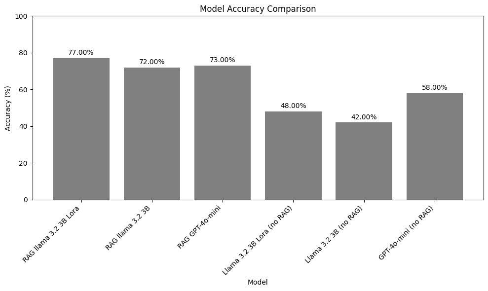

In this project, I demonstrate that it is not necessary to use a large and robust LLM to achieve significant results in tasks requiring technical and specialized knowledge.

By comparing a Llama 3.2 model with only 3 billion parameters, it is possible to achieve results similar to or even better than the gpt-4o-mini, using techniques such as RAG and Fine-Tuning.

In this specific case, I leverage knowledge from the telecommunications field with 3GPP specifications to compare the models. The TeleQnA dataset was used for training and testing, while the TSpec-LLM dataset was used for retrieval in the RAG process.

The results were encouraging, as shown in the figure below:

This Figure shows the comparison between models evaluating accuracy for multiple-choice questions

For more details about the project, read my report in [English_report](Project_report(english_version).pdf) explaining the analysis in greater depth.

* Agents:

The use of AI agents is very promising, offering the potential to perform multiple queries and conduct more effective searches. However, adequately adjusting the instruction prompt and defining the agent's sequence of steps for optimal execution remains a significant challenge.

This work also explores the use of agents in combination with the RAG tool. However, the results obtained with agents have not yet surpassed the performance achieved using RAG alone.

1. Dataset Folder

Follow the instructions from the following links to correctly clone the datasets.
 - TSpec-LLM:
   https://huggingface.co/datasets/rasoul-nikbakht/TSpec-LLM
 - TeleQnA:
   https://huggingface.co/datasets/netop/TeleQnA
 - Telco-RAG:
   https://github.com/netop-team/Telco-RAG
   
2. Files Folder

Files generated during development. Some codes don't need to run again.

3. Papers Folder

These are some articles used as a basis for the work.

4. Source Folder

Source Code of this project

It is possible to see the main results of this porject in path /Source/main_results.ipynb.

